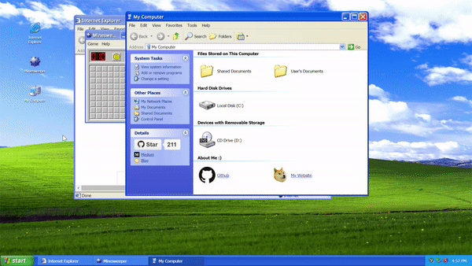

# WinXP

🏁 Web based Windows XP desktop recreation.

## Terminal

The `main/` page includes a rebuilt terminal with these commands:

- `cls`
- `dir`
- `cd`
- `start`
- `neofetch`
- `theme default`
- `layout compact|normal`
- `promptgap <px>`
- `help`

The terminal also supports command history with Up/Down arrows, Tab autocomplete, and persistent history in `localStorage`.

Features:

- Drag and resize, minimize, maximize windows
- Open applications from desktop icons or start menu
- Minesweeper, Internet Explorer, My Computer, Notepad, Winamp, Paint
- Power off menu

## [Try it!](https://wxp.vercel.app)

Windows XP 👉 https://wxp.vercel.app

## Contributing

Generally open an issue (or comment on an issue if there's one already) before starting work on a PR.

## License

The Windows XP name, artwork, trademark are surely property of Microsoft. This project is provided for educational purposes only. It is not affiliated with and has not been approved by Microsoft.

## Thanks
- [Webamp](https://github.com/captbaritone/webamp), Winamp 2 reimplementation by: [captbaritone](https://github.com/captbaritone)
- [JS Paint](https://github.com/1j01/jspaint), Paint reimplementation by: [1j01](https://github.com/1j01)
